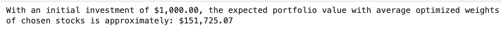

# FinTechProj1
### The objective of this project is to optimize one's portfolio using Monte Carlo Simulations and historical data from Alpacas spanning the past 20 years.

All parts of the Project completed by Donya Ahmadi

## Part 1 - Data (Collection, CleanUp, etc.)
### The first part included importing necessary libraries, initializing variables (including env), and importing historical data using Alpacas API. For this project, I chose AAPL, AMZN, AND MSFT, but any ticker will work. I displayed the daily return, mean, standard deviation, and last-day closing prices for my chosen tickers and the S&P 500.

## Part 2 - Monte Carlo Simulations
### A Monte Carlo simulation is a computational technique that uses random sampling to model and analyze complex systems or processes. In my code, I run 50 (can be changed) Monte Carlo simulations to optimize a portfolio's asset allocation based on historical stock data, aiming to maximize the Sharpe ratio. The results include optimal weights for each stock, the cumulative returns of the optimized portfolio, and a benchmark (S&P 500)

## Part 3 - Portfolio Optimization
### Portfolio optimization is a financial modeling technique that selects the optimal mix of assets to achieve a specific investment goal. The primary objective of portfolio optimization is to maximize returns, minimize risk, or achieve a trade-off between the two, given certain constraints. This section is an analysis of the Monte Carlo results. However, the purpose of this section is to analyze and compare the performance of the portfolio with the average weights obtained from the Monte Carlo simulations against a uniform portfolio with equal weights. 

## Part 4 - Data Visualization 
